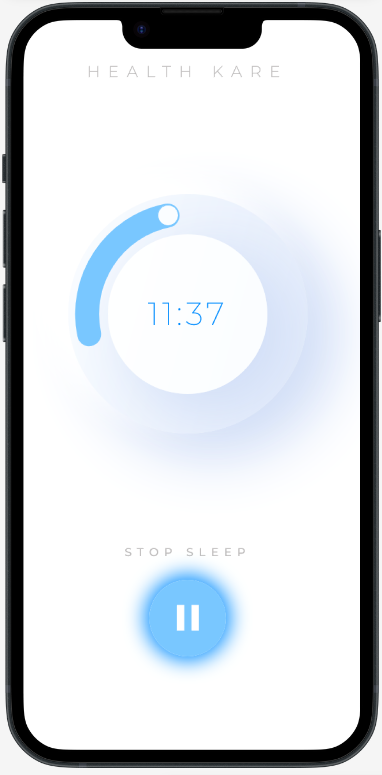
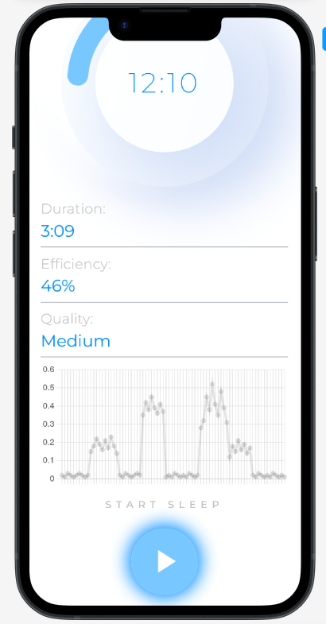

# Sleep Tracker

Sleep Tracking app with an extensive analysis of sleep quality.

## Usage
1. Go to https://manu-gibst-github-io.vercel.app/ (from smartphone)
2. Press the **Start** button.
3. Wait a couple of minutes. 
4. Press the **Stop** button. 
5. View ur sleep analysys and graph. 
## Tech Stack
### Frontend
- Frameworks: *Vue.js, Quasar PWA*
- Additional packages: *axios, chart.js*
- Hosting: *Vercel*
### Backend
- Frameworks: *node.js, express.js*
- Hosting: *AWS EC3, Route 53*

## Formulas:
* To calculate `stroke-linecap` for time indicaton$^7$:
$$
2 \cdot \pi * R
$$
* To convert time to coordinates
$$
degrees = (hours \space \% \space 12) \cdot 30^\circ + minutes \space \cdot \space 0.5^\circ
$$
$$
x = Size + R \sin(degrees)
$$
$$
y = Size + R \cos(degrees)
$$

### Challenges
- **Bad architecture**. My inexperience in a new framework resulted in a poor architecture and lack of component based design. I started really to understand Vue.js only towards the end of development. 
- **Network difficulties**. During the development I stumbled upon problems of working with HTTPS protocol. For example I couldn't connect to backend because it had HTTP protocol, so I had to use *ngrok* and then later *AWS EC2 with Route 53*. 
- **JavaScript issues**. It was very hard to find errors with JavaScript, it is far better to use TypeScript. 
### Limitations
- **Background worker**. Unfortunately, it is impossible to implement background worker to track accelerometer without going into native implementations. 
## Conclusion
Overall, this project was really fun. I had great time developing non-stop for 3 days straight.  
This project tested my adaptability to new frameworks. I am proud to say that I have made a decent app despite it being my first time working with *Vue.js* and *Express.js*.  
There were other things that I wanted to implement like dark theme, weekly statistics, but I was running out of time. 
   

Below are the most of the sources that I used during the development. 

## References:
1. Vue.js Documentation Tutorials. [Tutorials Link](https://vuejs.org/tutorial/). 
2. Make Apps With Danny. [Video link](https://www.youtube.com/watch?v=PjCqsf87Z1Y). *To get started with the UI*
3. jeetvora331. [Throttling in JavaScript Easiest Explanation](https://dev.to/jeetvora331/throttling-in-javascript-easiest-explanation-1081). 
4. mdn. [Window: setInterval() method](https://developer.mozilla.org/en-US/docs/Web/API/Window/setInterval)
5. ngrok. [ngrok.com/docs](https://ngrok.com/docs). 
6. Quasar Style & Identity Documentation. [https://quasar.dev/style/theme-builder](https://quasar.dev/style/theme-builder)
7. Stackoverflow. [https://stackoverflow.com/questions/69169928/i-need-to-make-a-circular-progress-bar-with-rounded-ends](https://stackoverflow.com/questions/69169928/i-need-to-make-a-circular-progress-bar-with-rounded-ends)
8. Sam Meech-Ward. *Easily Deploy Full Stack Node.js Apps on AWS EC2 | Step-by-Step Tutorial.* [https://www.youtube.com/watch?v=nQdyiK7-VlQ](https://www.youtube.com/watch?v=nQdyiK7-VlQ)